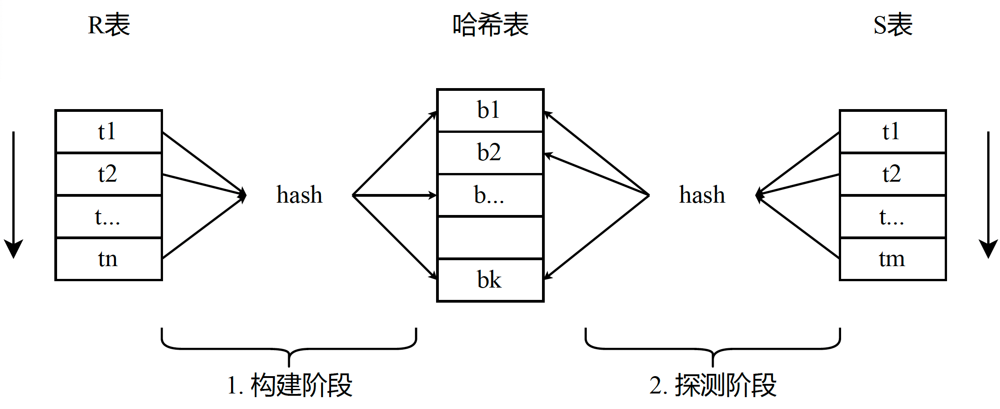

> 请不要将代码提交到公开仓库（包括提交带有题解的 Pull Request），同时也请不要抄袭其他同学或网络上可能存在的代码。

# LAB#2 查询引擎

在数据库系统实现原理与实践课程的 [LAB#1](lab1.md) 中，你已经完成了数据库系统中的存储引擎（基于 LSM-Tree 的存储引擎）。在这个实验中，你将实现数据库系统中的查询引擎（基于 MiniOB）。你需要根据此文档的指导，完成 MiniOB 查询引擎中的语法解析，查询优化，查询执行等模块。

## 实验

本实验包含如下几个子任务：

- 任务1: Select 查询（支持 order by 语法）
- 任务2: Join 算子实现（实现 hash join 算子）
- 任务3: 查询优化（针对 Join 算子进行查询优化）

### 任务1: Select 查询（支持 order by 语法）

#### 背景介绍
排序是数据库系统的一个基本功能，可以将查询的结果按照指定的条件表达式和顺序进行排序。
`ORDER BY` 子句用于对结果进行排序，以升序或降序顺序排序。默认情况下按升序对结果进行排序。如果要按降序进行排序，需要显式指定 `DESC` 关键字。

ORDER BY 子句语法格式如下：
```
select_stmt:
    SELECT 
        select_expr_list
        [FROM from_list]
        [WHERE where_condition]
        ...
        [ORDER BY order_by_condition_list];

order_by_condition_list:
    order_by_condition [, order_by_condition ...]

order_by_condition:
    expression [ASC | DESC]
```
其中：

`expression [ASC | DESC]` 表示对结果集排序的条件表达式，**expression 只支持字段名即可**。

`ASC | DESC` 为可选参数，用于指定排序的顺序。ASC 表示升序（默认），DESC 表示降序。

`ORDER BY` 语法示例如下：

查询表 tbl1 的数据，根据 col3 按降序（DESC）输出查询结果。

```sql
SELECT * FROM tbl1
  ORDER BY col3 DESC;
```

#### 实现

请实现 `ORDER BY` 子句的语法。可参考 `docs/docs/design/miniob-how-to-add-new-sql.md` 中关于如何添加新的 SQL 语法的文档，实现 `ORDER BY` 子句。

**提示**

- `ORDER BY` 子句中的表达式只支持字段名即可，即只需支持 `ORDER BY col3 DESC;`，其中 `col3` 是字段名，不需要支持类似 `ORDER BY col3 + 1 DESC;` 的语法。
- 可以使用 `test/test/case/miniob_test.py`工具进行 SQL 功能性的测试，相关使用文档位于 `test/test/case/README.md`，部分测试用例可参考 `test/case/test/primary-order-by.test`。

### 任务2: Join 算子实现

#### 背景介绍
连接（Join）操作被用来将两个或多个关系表的数据组合起来。

Nested Loop Join（NLJ）算法通过双层循环来输出结果，其中左表为外循环，右表为内循环。目前 MiniOB 中已经实现了 Nested Loop Join 算子（相关实现位于 `src/observer/sql/operator/join_physical_operator.h`）。

基于哈希的连接（Hash Join）算法其执行过程分为两个阶段：构建阶段和探测阶段。哈希连接在两个关系表上执行，假设这两个关系表分别为 R 表和 S 表。在构建阶段，会遍历其中一个关系表（通常是基数较小的表，如图中的 R 表），以参与连接的属性列为键在一个哈希表中存储。在探测阶段，会遍历另一个关系表 S 的所有记录，以参与连接的属性列为键在哈希表中探测，当探测到具有相同键的记录则将结果输出。


在 MiniOB 中，你需要实现基于火山模型的 HashJoin 算子即可，在火山模型中，每个查询计划操作符（operator）都实现了一个 `next()` 函数。在每次调用时，操作符要么返回一个元组(tuple)，要么在没有更多元组时返回一个空结果。每个操作符在它的子运算符调用 `next()` 来获取元组，然后对它们进行处理，并向上返回结果。

#### 实现
请在 `src/observer/sql/operator/hash_join_physical_operator.h` 中实现 HashJoin 算子，可以参考 Nested Loop Join 算子的实现。

除了实现 HashJoin 算子外，你还需要实现 INNER JOIN 语法。

语法示例如下：
```sql
SELECT * FROM tbl1 INNER JOIN tbl2 ON tbl1.col3 = tbl2.col4;
```

在没有完成 `任务3: 查询优化` 之前，你可以通过配置项来指定是否使用 Hash Join 算子。将 `hash_join` 配置项设置为 1，且满足 HashJoin 的条件时，MiniOB 将使用 Hash Join 算子进行 Join 计算。
配置项设置如下：
```
set hash_join=1;
```

**提示**
- 你的修改可能不止包含 `src/observer/sql/operator/hash_join_physical_operator.h/.cpp` 中的代码。
- 可以参考 Nested Loop Join 算子的实现。
- 需要实现 INNER JOIN 语法，并将 `INNER JOIN table ON expr` 中的条件表达式 `expr` 放到 `Hash Join` 算子中，支持 `expr` 中包含单个等值条件即可。
- 可以通过 `Explain` 语句来查看你的执行计划。
- 可以使用 `test/test/case/miniob_test.py`工具进行 SQL 功能性的测试，相关使用文档位于 `test/test/case/README.md`，部分测试用例可参考 `test/case/test/dblab-hash-join.test`。
- 需要补充 `PhysicalPlanGenerator::can_use_hash_join` 函数，在等值比较条件下使用 hashjoin 算子。


### 任务3: 查询优化（针对 Join 算子进行查询优化）

#### 背景

查询优化负责将 SQL 转换为数据库系统可以执行的最优的物理执行计划。优化器对整个数据库系统的性能影响很大，因此优化器是数据库系统中最重要的部分之一。
目前在 MiniOB 中，我们将优化器的执行分为两层：查询改写（基于规则的优化）和基于代价的优化（CBO）。即先执行基于规则的查询改写，基于规则的查询改写只会做逻辑算子到逻辑算子的转换；之后再执行基于代价的优化，基于代价的优化目前只会做逻辑算子到物理算子的转换。

##### 查询改写（基于规则）

目前 MiniOB 中查询改写的实现比较简单，我们定义了若干静态规则（本质上是 `if-else` 子句，相关代码位于 `src/observer/sql/optimizer/rewriter.h`），这些规则将逻辑算子转换为逻辑算子而无需进行基于成本的搜索。例如谓词下推，谓词条件重写等。

##### 查询物理优化（基于代价）

目前 MiniOB 中基于代价的优化采用了 `cascade` 优化器框架，执行自顶向下的搜索来找到最优的物理执行计划。

MiniOB 中的 `Cascade Optimizer` 设计文档可参考 `src/observer/optimizer/cascade/README.md`， MiniOB 中的实现主要参考了 [columbia](https://github.com/yongwen/columbia) 和 [noisepage](https://github.com/cmu-db/noisepage) 的实现。

关于 cascade 优化器原理的更多细节可以参考相关论文：
1. [cascade 论文](https://15721.courses.cs.cmu.edu/spring2016/papers/graefe-ieee1995.pdf)
2. [columbia 论文](https://15721.courses.cs.cmu.edu/spring2019/papers/22-optimizer1/xu-columbia-thesis1998.pdf)

#### 实现
在这一任务中，你需要实现基于规则的谓词下推优化规则将 where 子句中的条件下推到 join 算子或 join 算子的子节点上，需要实现基于代价的 Join 物理算子选择（Nested Loop Join 或 Hash Join）。

##### 查询改写
在任务2中，你已经实现了 Hash Join 算子，并且所有的测试 SQL 语句都是 INNER JOIN 语法。在本任务中，Join 的连接条件可能出现在 where 子句中，你需要从 where 条件中提取谓词条件，将可以进行谓词下推的条件下推到 Join 算子，或者Join 算子的子节点中。

举例1：
```sql
SELECT * FROM tbl1, tbl2 where tbl1.col3 = tbl2.col4 AND tbl1.col5 > 100;
```
上述语句中，`tbl1.col5 > 100` 可以下推到 tbl1 对应的 TableScan 算子中，`tbl1.col3 = tbl2.col4` 可以下推到 Join 算子中。

举例2：
```sql
SELECT * FROM tbl1, tbl2, tbl3 WHERE tbl1.a = tbl2.a AND tbl2.a > tbl3.a AND tbl3.a > 100;
```
上述语句中，`tbl3.a > 100` 可以下推到 tbl3 对应的 TableScan 算子中，`tbl2.a > tbl3.a` 和 `tbl1.a = tbl2.a` 可以下推到对应的 Join 算子中。

提示：
- 不需要考虑 OR 条件。
- 谓词下推的规则在 `src/observer/sql/optimizer/predicate_to_join_rule.h` 中实现。
- 部分测试用例可参考 `test/case/test/dblab-optimizer.test`
- 如何确定什么时候谓词可以下推到 join 算子/ join 算子的子节点？可以在每个算子节点中存一下涉及到的表名/表ID，同时在每个谓词表达式中也存储涉及到的表名/表ID，然后可以通过判断谓词涉及到的表名/表ID 是否在算子节点中出现来确定。
- 需要考虑谓词条件下推到 JOIN 子节点后，如果可以继续下推，需要将谓词条件继续下推，并尽可能消除谓词过滤（Predicate）算子。（例如对于 `select * from tbl1, tbl2 where tbl1.a > 1`，需要将 `tbl1.a > 1` 下推到 TableScan 算子）

##### 查询物理优化
你需要基于 Cascade Optimizer（主要代码位于 `src/observer/sql/optimizer/cascade` 中）实现 Join 物理算子选择，即选择 HashJoin 或 NestedLoopJoin 作为 Join 算子的物理算子。你需要根据参与Join 表的基数和谓词条件来计算两个算子的代价，并选择代价较低的 Join 物理算子。

代价计算规则如下：
1. NestedLoopJoin 算子的代价计算公式如下：
$$
cost_{nlj} = left \times right \times CPU + output \times CPU
$$

其中  left 表示左边算子的基数，right 表示右边算子的基数，output 表示输出的基数，CPU 表示一次 CPU 操作的代价。
2. HashJoin 算子的代价计算公式如下：
$$
cost_{hashjoin} = left * hash\_cost + right * hash\_probe + output * CPU
$$
其中，left 表示左边算子的基数，right 表示右边算子的基数，hash_cost 表示构建阶段的一次插入哈希表操作的代价，hash_probe 表示探测阶段一次探测（probe）的代价，output 表示输出的基数，CPU 表示一次 CPU 操作的代价。

**提示**
- 可参考 `src/observer/sql/optimizer/cascade/README.md` 文档添加新的转换规则。
- 需要先完成任务2 以及谓词条件下推改写规则。 
- 请不要修改 `src/observer/sql/optimizer/cascade/cost_model.h`
#### 测试

为了使用 Cascade Optimizer，你需要首先设置 cascade 配置项：
```
set use_cascade = 1;
```

在执行 SQL 之前，你需要首先收集对应表的统计信息，当前的统计信息主要是表的基数（表中记录的行数）。

收集统计信息的语法如下：
```sql
analyze table tbl1;
```
上述语句会收集表 `tbl1` 的统计信息，并将统计信息存储在内存中。

提示：
- 部分测试用例可参考 `test/case/test/dblab-optimizer.test`。

