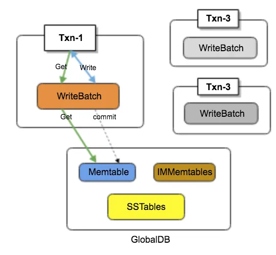

> 请不要将代码提交到公开仓库（包括提交带有题解的 Pull Request），同时也请不要抄袭其他同学或网络上可能存在的代码。

# LAB#3 事务引擎

每次实验代码更新，需要将代码从远端仓库拉取下来，大家需要从 miniob 的 github 仓库上把代码拉取到本地。

```
1. git remote add origin_ob https://github.com/oceanbase/miniob.git
2. git pull origin_ob
3. git merge origin_ob/main
4. 解决git冲突
5. 实现代码，推送到自己的github仓库上
```

在数据库系统实现原理与实践课程的 [LAB#1](lab1.md)，[LAB#2](lab2.md) 中，你已经完成了数据库系统中的存储引擎（基于 LSM-Tree 的存储引擎）,查询引擎（实现查询算子，优化执行计划等）。在这个实验中，你需要为 LAB#1 中实现的 LSM-Tree 存储引擎支持事务，同时支持数据库的持久化和恢复。你需要根据此文档的指导，完成事务引擎以及数据库的持久化和恢复。

## 实验

本实验包含如下几个子任务：

- 任务1: 实现基于 LSM-Tree 的 MVCC 事务
- 任务2: 实现数据库的持久化和恢复

### 任务1: 实现基于 LSM-Tree 的 MVCC 事务

#### 背景介绍
MVCC（Multi-Version Concurrency Control）是一种并发控制技术，其核心目标是：

* 支持事务语义：通过存储一个键的多个"版本"，使事务读取到一致的快照，而不受其他事务更新的影响。
* 提高并发性能：避免因锁争用导致的性能问题，使读操作无需阻塞写操作。
* 实现数据的时间旅行（Time Travel）：通过特定的历史版本读取支持点时间查询。

在 LSM-Tree 中，每条数据被存储为一个 Key-Value 对。为了支持 MVCC，需要为每个 Key-Value 增加一个时间戳。一个 Key-Value 对以如下方式编码存储。
```
  key_size     : internal_key.size()
  key bytes    : char[internal_key.size()]
  seq          : uint64(sequence)
  value_size   : value.size()
  value bytes  : char[value.size()]
```

在增加了时间戳之后，就可以通过在事务内部申请一个额外的 WriteBatch 的方式实现事务。每个事务操作会在事务内部申请一个 WriteBatch，所有事务提交之前的读都优先读该 WriteBatch(保证了同一个事务内可以看到该事务的写操作)，写操作都直接写入该事务独有的WriteBatch中，事务提交时再依次写入 WAL 和 memtable。


#### 实现
你需要实现 `src/oblsm/include/ob_lsm_transaction.h::ObLsmTransaction` 中未完成的函数，使 LSM-Tree 支持事务。你可以通过 `unittest/oblsm/ob_lsm_transaction_test.cpp` 中的测试用例来验证你的实现是否正确。

你需要实现 `src/observer/storage/table/lsm_table_engine.h` 中如下几个函数，以使 MiniOB 支持事务。
```
RC insert_record_with_trx(Record &record, Trx* trx) override;
RC delete_record_with_trx(const Record &record, Trx* trx) override;
RC update_record_with_trx(const Record &old_record, const Record &new_record, Trx* trx) override;
```

你可以通过开启多个 obclient 测试 MiniOB 中的事务。

**提示** 测试过程中，需要在启动 observer 时指定存储引擎为lsm，事务类型为lsm。即 `-E lsm -t lsm`

**测试用例示例**
```
client 1:                         client 2:
insert into t1 values(0, 0);
begin;
                                  begin;
insert into t1 values(1, 1);
select * from t1;
                                  select * from t1;
delete from t1 where id = 0;
select * from t1;                 select * from t1;
                                  insert into t1 values(3,3);
                                  select * from t1;
select * from t1;        
commit;
                                  select * from t1;
                                  commit;
                                  select * from t1;
```

**提示** 你需要实现快照隔离（Snapshot Isolation）级别的 MVCC 事务。

**提示** 事务提交时可以使用`ObLsmImpl::batch_put`，来一次性写入一批数据，需要考虑这一批数据写入的原子性，以及写入过程中的失败回滚。

**提示** 在 lab#3 中需要支持两个客户端并发执行简单的 update 语句。例如：`update t set a = 1 where b = 2`。在后续 lab#4 中还需要支持更复杂的 update 语法，详情可参考lab#4 文档。

**思考** 当前的 WriteBatch 是完全在内存中的，如果事务中涉及的大小超过内存大小应该如何处理？

## 任务2: 实现数据库的持久化和恢复

#### 背景介绍
在 LAB#1 中，你已经实现了 LSM-Tree 的基本功能，但是你应该发现如果关闭 LSM-Tree 之后重新打开，之前写入的数据可能并不会存在，这是由于 LAB#1 中还没有实现 LSM-Tree 的持久化和恢复机制。在本任务中，你需要实现 LSM-Tree 的持久化和恢复机制，同时基于 LSM-Tree 的 MiniOB 也要支持持久化和恢复。这里介绍下 LSM-Tree 的持久化和恢复机制的实现思路：

* 通过 Write Ahead Log（WAL）实现 MemTable 数据的持久化。
  
WAL 是一种常见的日志机制，用于确保数据的可靠性和持久性。在 LSM-Tree 中，每次数据写入之前，都会先写入 WAL 文件，这是一个文件日志，记录了数据变更的操作细节。即便系统发生故障，数据库可以通过 WAL 文件恢复写入到 MemTable 的数据，从而防止数据丢失。

* 通过 Manifest 文件实现 SSTable 状态的持久化。

Manifest 文件是 LSM-Tree 的 "元数据目录"，用于记录某一时间点 LSM-Tree 的状态。它描述了 LSM-Tree 中每个 SSTable 文件的元数据（如编号、层级等），使数据库能够在重启或恢复时快速加载恢复 SSTable 的状态。

更多细节可参考[LSM-Tree 设计文档](../design/miniob-lsm-tree.md)

除此之外，还要考虑 MiniOB 中的持久化和恢复机制。

在 LSM-Tree 支持持久化和恢复之后，MiniOB 只需要支持与 MiniOB 相关的表元数据的持久化和恢复即可。例如，表的元数据`TableMeta`，自增列 ID 等。

#### 实现

你需要实现 `src/oblsm/wal/ob_lsm_wal.h` 中未完成的函数，完成 Write Ahead Log 功能，以使 LSM-Tree 支持持久化和恢复。你可以通过 `unittest/oblsm/ob_lsm_wal_test.cpp` 中的测试用例来验证你的实现是否正确。

除此之外，你还需要考虑在 ObLsm 重启时，从 WAL 中恢复记录到 MemTable 中。可参考 `src/oblsm/ob_lsm_impl.h::ObLsmImpl::recover`

你需要在 `LsmTableEngine` 初始化时，从 LSM-Tree 中恢复自增列 ID  `inc_id_`。

**思考** MiniOB 中是否需要存储额外 LSM-Tree 存储引擎日志，用于持久化和恢复？
